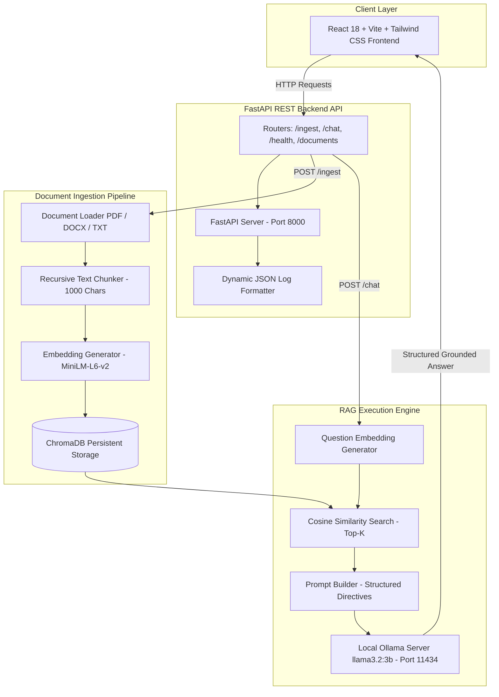

# Production-Grade Local LLM Document Q&A Chatbot (RAG)

[](https://www.python.org/)
[](https://fastapi.tiangolo.com/)
[](https://reactjs.org/)
[](https://tailwindcss.com/)
[](https://www.trychroma.com/)
[](https://ollama.ai/)

A production-grade, privacy-first **Retrieval-Augmented Generation (RAG)** system running **100% locally**. The system enables users to upload document files (`PDF`, `DOCX`, `TXT`), extract text, index 384-dimensional vector embeddings, and execute grounded, highly detailed Q&A queries powered by local **Ollama** (`llama3.2:3b`) without cloud dependencies or external API costs.

---

## 🌟 Key System Features

- **100% Local Inference & Privacy**: Powered locally by Ollama (`llama3.2:3b`) and Sentence Transformers (`all-MiniLM-L6-v2`). Zero network leaks.
- **Exhaustive & Structured Markdown Responses**: Engineered system prompt directives enforce complete, non-truncated section breakdowns with bold headers, underline dividers (`-------`), bullet points, and clean Markdown tables.
- **Strict Grounding & Zero Hallucination**: Strict fallback policy ensures that if relevant context is absent from uploaded documents, the model responds with: `"I don't know based on the provided documents."`
- **Sentence-Aware Text Chunking**: Custom recursive character chunking (`chunk_size=1000`, `chunk_overlap=150`) keeps document sections, bullet lists, and multi-part specs intact.
- **Multi-Format Document Ingestion**: Native loaders for `.pdf`, `.docx`, and `.txt` files with page-level text extraction and metadata tracking.
- **Persistent Vector Storage**: Managed local vector indexing with ChromaDB (`storage/chroma`) supporting document listing, chunk fetching, and deletion.
- **Modern Responsive Dark-Mode UI**: Built with React 18, Vite, and Tailwind CSS. Features real-time typing indicators, document upload modals, clear chat thread actions, and status health pills.
- **Structured JSON Logging & Metrics**: Real-time logging targeting `logs/app.log` tracking vector search latency, LLM inference timing, and token throughput.

---

## 🏗️ Architecture Diagram



---

## 📁 Repository Directory Structure

```
local_llm_qa_ai/
├── .env.example                # Environment configuration template
├── .env                        # Active system environment variables
├── .gitignore                  # Git tracking exclusion rules
├── .dockerignore               # Docker build exclusion rules
├── docker-compose.yml          # Multi-container orchestration config
├── README.md                   # System documentation & setup guide
├── logs/                       # Application log directory
│   ├── .gitkeep
│   └── app.log                 # JSON & Console structured log output
├── storage/                    # Persistent storage directory
│   ├── chroma/                 # Local ChromaDB vector database index
│   └── uploads/                # Ingested raw document files
├── backend/
│   ├── Dockerfile              # Python 3.10 CPU PyTorch container spec
│   ├── requirements.txt        # Backend Python dependencies
│   ├── main.py                 # FastAPI application entry point & CORS
│   ├── config/
│   │   ├── __init__.py
│   │   └── settings.py         # Pydantic BaseSettings management
│   ├── logging/
│   │   ├── __init__.py
│   │   └── logger.py           # Custom JSON & Console multi-handler logger
│   ├── schemas/
│   │   ├── chat.py             # Chat request & response Pydantic models
│   │   ├── document.py         # Document ingestion & detail models
│   │   └── health.py           # System health check status models
│   ├── rag/
│   │   ├── loaders.py          # Modular PDF, DOCX, TXT loaders
│   │   ├── chunker.py          # Sentence-aware recursive text splitter
│   │   ├── embeddings.py       # SentenceTransformers vector embedder
│   │   ├── vectorstore.py      # ChromaDB storage & search client
│   │   ├── prompt_builder.py   # Grounded prompt builder & directives
│   │   ├── llm_client.py       # Async Ollama HTTP client (180s timeout)
│   │   └── pipeline.py         # Master RAG orchestrator pipeline
│   ├── api/
│   │   ├── dependencies.py     # FastAPI Dependency Injection
│   │   └── routers/
│   │       ├── health.py       # GET /health
│   │       ├── ingest.py       # POST /ingest
│   │       ├── chat.py         # POST /chat
│   │       └── documents.py    # GET /documents & DELETE /documents/{id}
│   └── tests/                  # Pytest automated test suite
│       ├── test_api.py
│       ├── test_chunker.py
│       ├── test_embeddings.py
│       ├── test_prompt_builder.py
│       ├── test_retrieval.py
│       └── test_vectorstore.py
└── frontend/                   # React 18 + Vite + Tailwind CSS App
    ├── Dockerfile              # Multi-stage Nginx production container
    ├── package.json
    ├── vite.config.js
    ├── tailwind.config.js
    ├── postcss.config.js
    ├── index.html
    └── src/
        ├── index.css
        ├── App.jsx
        ├── main.jsx
        ├── components/
        │   ├── Header.jsx
        │   ├── Sidebar.jsx
        │   ├── ChatWindow.jsx
        │   ├── ChatMessage.jsx
        │   ├── FileUpload.jsx
        │   └── TypingIndicator.jsx
        └── services/
            └── api.js          # Axios REST API client instance
```

---

## ⚡ Prerequisites

Before running the application, verify that your machine meets the following requirements:

1. **Python**: Version `3.10` or higher (`python --version`).
2. **Node.js**: Version `18.0` or higher (`node -v`).
3. **Ollama Engine**: Installed from [ollama.ai](https://ollama.ai/).
4. **Pull Target LLM Model**:
   ```bash
   ollama pull llama3.2:3b
   ```
   Ensure the Ollama background service is running locally at `http://localhost:11434`.

---

## 🚀 Setup & Execution Guide

### Option A: Local Native Execution (Recommended)

#### 1. Setup Backend Environment
Open a terminal in the project root (`local_llm_qa_ai`):
```powershell
# Create Python virtual environment
python -m venv venv

# Activate virtual environment (Windows)
.\venv\Scripts\activate
# On Linux / macOS: source venv/bin/activate

# Install backend dependencies
pip install -r backend/requirements.txt
```

#### 2. Start Backend API Server
```powershell
# From project root with activated virtual environment
python -m backend.main
```
- **API Base URL**: `http://localhost:8000`
- **Interactive Swagger Docs**: `http://localhost:8000/docs`

#### 3. Start Frontend Web Interface
Open a second terminal window:
```cmd
cd frontend
npm install
npm run dev
```
- **Web App URL**: `http://localhost:5173`

---

### Option B: Docker Compose Execution

To build and launch containerized backend and frontend services:
```bash
docker-compose up --build
```
- Access the Web Application at `http://localhost:5173`.
- Access the Backend API at `http://localhost:8000/docs`.

---

## 🧪 Running Automated Unit & Integration Tests

The project includes an extensive test suite covering document chunking, vector embeddings, similarity search, prompt directives, and REST endpoints.

Run the test suite using `pytest`:
```powershell
.\venv\Scripts\python.exe -m pytest backend/tests
```

**Expected Test Output**:
```text
============================= test session starts =============================
collected 16 items

backend\tests\test_api.py .....                                          [ 31%]
backend\tests\test_chunker.py ...                                        [ 50%]
backend\tests\test_embeddings.py ...                                     [ 68%]
backend\tests\test_prompt_builder.py ..                                  [ 81%]
backend\tests\test_retrieval.py ..                                       [ 93%]
backend\tests\test_vectorstore.py .                                      [100%]

======================= 16 passed, 1 warning in 30.18s =======================
```

---

## 📑 API Reference Specification

| Method | Endpoint | Description |
| :--- | :--- | :--- |
| `GET` | `/health` | Verifies local Ollama service, model status, and ChromaDB connection. |
| `POST` | `/ingest` | Uploads `.pdf`, `.docx`, or `.txt` document, parses text, and indexes vector chunks. |
| `POST` | `/chat` | Runs semantic search on ChromaDB, builds grounded prompt, and returns Ollama response. |
| `GET` | `/documents` | Lists all indexed documents along with chunk counts and metadata. |
| `GET` | `/sources/{document_name}` | Retrieves vector chunks and metadata for a specific document. |
| `DELETE` | `/documents/{document_name}` | Deletes raw document file and purges all related vector chunks from ChromaDB. |

---

## 💡 System Performance & Optimization Observations

1. **CPU LLM Evaluation Speed**:
   - Local CPU inference for `llama3.2:3b` generates ~15–25 tokens/second.
   - Client HTTP timeout is configured to `180.0` seconds in `llm_client.py` to prevent premature request cancellations during heavy CPU generation.

2. **Chunk Size Tuning**:
   - `chunk_size = 1000` characters with `chunk_overlap = 150` characters prevents breaking multi-bullet sections or technical specification lists mid-sentence.

3. **Dense Vector Embeddings**:
   - `sentence-transformers/all-MiniLM-L6-v2` produces 384-dimensional dense vectors in ~15–30ms per batch on CPU, storing normalized cosine distances in ChromaDB (`hnsw:space: cosine`).
